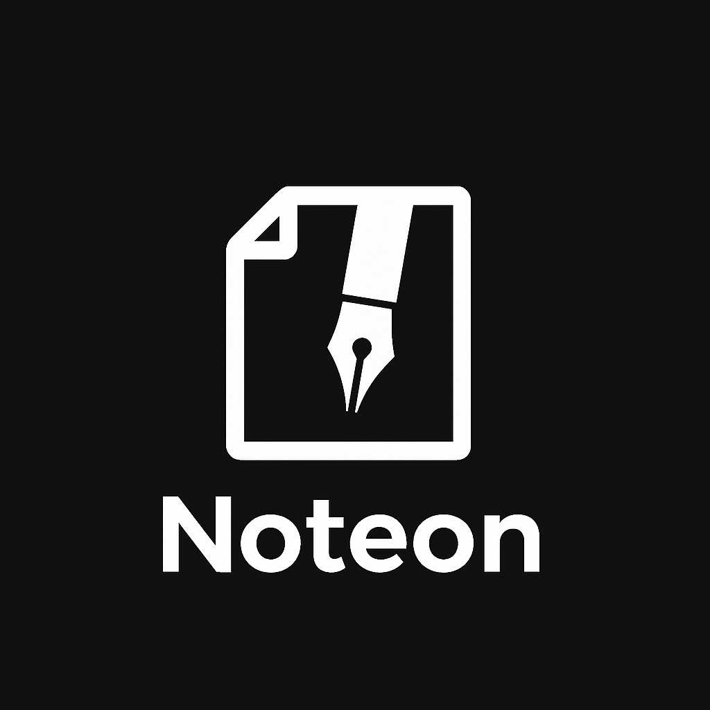
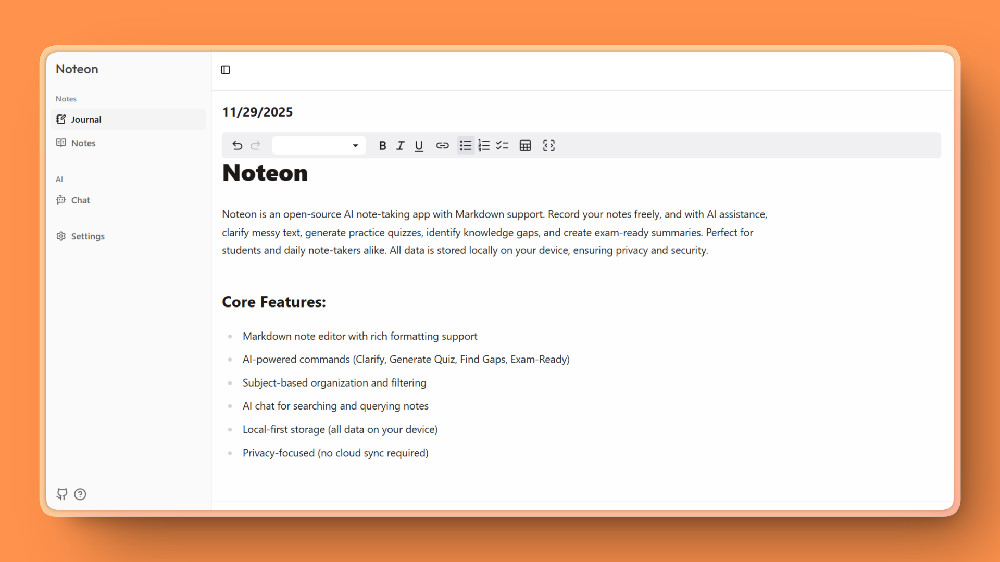

# Noteon

[](https://github.com/Kehn-Marv/Noteon)
[](https://github.com/Kehn-Marv/Noteon)
[](https://github.com/Kehn-Marv/Noteon)
[](LICENSE)

<div align="center">
  
  <p><strong>Your AI-Powered Note Taking Companion</strong></p>
</div>

## What is Noteon?

Noteon is a privacy-first note-taking app that runs entirely in your browser. No accounts, no servers, no setup—just open it and start writing. Your notes live in your browser's local storage, giving you complete control over your data.

What makes Noteon different is its optional AI layer. When you add an API key, your notes become interactive—ask questions, generate study materials, clarify complex ideas, or find knowledge gaps. Without AI, it's still a clean, fast markdown editor with journal and notes organization. You choose how much intelligence you want.



## How It Works

Noteon uses a local-first architecture powered by IndexedDB (via Dexie) to store all your notes directly in your browser. Everything is automatic—notes save as you type, no sync required. The app works completely offline and requires zero configuration to get started.

AI features are entirely optional. Add your Google AI API key through the Settings page (stored securely in browser cookies), and you unlock intelligent chat with your notes, AI-powered commands (clarify, generate quiz, find gaps, exam-ready summaries), and semantic search. Without an API key, Noteon remains a powerful local markdown editor with journal and notes organization.

**Key Features:**
- **Zero Setup**: Works immediately, no configuration needed
- **Local-First**: All data stored in IndexedDB on your device
- **Markdown Editor**: Rich formatting with live preview
- **AI Commands**: Clarify text, generate quizzes, find knowledge gaps, create summaries
- **AI Chat**: Ask questions and get contextual answers from your notes
- **Smart Organization**: Separate journal entries and knowledge notes
- **Privacy Focused**: No cloud sync, optional AI features

## Tech Stack

- **Next.js 15.1** - React framework with App Router
- **React 19** - UI library
- **TypeScript** - Type safety
- **Dexie** - IndexedDB wrapper for local storage
- **Vercel AI SDK** - AI integration (optional)
- **Tailwind CSS** - Styling
- **Radix UI** - Accessible components

## Getting Started

**Prerequisites:**
- Node.js 20 or higher
- npm, yarn, or pnpm

**Quick Start:**

1. Clone and install:
```bash
git clone https://github.com/Kehn-Marv/Noteon.git
cd Noteon
npm install
```

2. Run the app:
```bash
npm run dev
```

3. Open [http://localhost:3000](http://localhost:3000)

That's it! The app works immediately with full note-taking features. To enable AI features, simply add your Google AI API key in the Settings page within the app—no environment variables needed.

## Running in Production

**Docker:**
```bash
docker build -t noteon .
docker run -p 3000:3000 noteon
```

**Standard Build:**
```bash
npm run build
npm run start
```

## Documentation

For more detailed information, check out the [docs](./docs) directory:
- [Architecture](./docs/ARCHITECTURE.md)
- [Development Guide](./docs/DEVELOPMENT.md)
- [API Reference](./docs/API.md)
- [Features](./docs/FEATURES.md)

## Contributing

Contributions are welcome! Feel free to open issues or submit pull requests.

## License

GNU Affero General Public License v3.0 - see [LICENSE](LICENSE) for details.

---

**Noteon** - Made by [Kehn Marv](https://x.com/KehnMarv)
